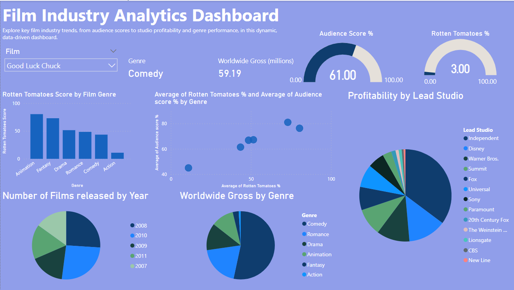

# Film Industry Analytics Dashboard

Explore key film industry trends, from audience scores to studio profitability and genre performance, in this dynamic, data-driven dashboard.

## Project Overview

This repository contains a data analysis project focusing on the film industry. It includes initial data cleaning and exploratory analysis performed with Python and pandas, followed by the creation of an interactive dashboard in Power BI.

The final output is a Power BI dashboard which provides insights into various aspects of the film industry including average ratings, the number of movies produced per year, audience scores, profitability by studio, and worldwide gross revenue by genre.

## Repository Contents

- `cleaning_notebook.ipynb`: Jupyter notebook containing the Python code used for initial data cleaning and exploratory analysis.
- `HollywoodsMostProfitableStories.csv`: The original dataset used for the analysis.
- `Cleaned Movie Data.csv`: The cleaned dataset after processing with pandas, ready for visualization in Power BI.
- `Movies Dashboard.pbix`: The Power BI dashboard file that can be opened with Microsoft Power BI Desktop.
- `MovieDashboard.PNG`: A screenshot of the dashboard for a quick preview.

## Dashboard Visualizations

### Visualizations Description

#### Filters:
- **Film Dropdown:** Filter the dashboard data for a specific film.

#### Charts:
1. **Rotten Tomatoes Score by Film Genre:** Bar chart showing average Rotten Tomatoes scores by genre.
2. **Average of Rotten Tomatoes % and Average of Audience Score % by Genre:** Scatter plot correlating critical and audience scores by genre.
3. **Number of Films Released by Year:** Pie chart displaying the distribution of film releases over years.
4. **Worldwide Gross by Genre:** Pie chart depicting worldwide gross revenue by genre.
5. **Audience Score %:** Gauge chart indicating audience score percentage.
6. **Rotten Tomatoes %:** Gauge chart showing the Rotten Tomatoes percentage.
7. **Profitability by Lead Studio:** Donut chart representing profitability categorized by the lead studio.

#### Additional Elements:
- **Worldwide Gross (millions):** Text box with the total worldwide gross for the selected film/genre.
- **Description Text Box:** Provides context or insights into the data presented.

## How to Use

To explore the data and visualizations:
1. Clone this repository to your local machine.
2. Open the `cleaning_notebook.ipynb` in Jupyter to view the data cleaning process.
3. Check `Cleaned Movie Data.csv` for the processed dataset.
4. Open `Movies Dashboard.pbix` with Power BI Desktop to interact with the dashboard.

